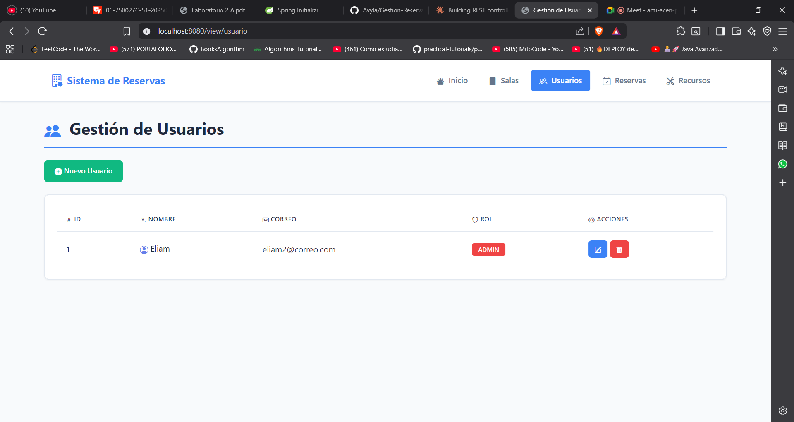
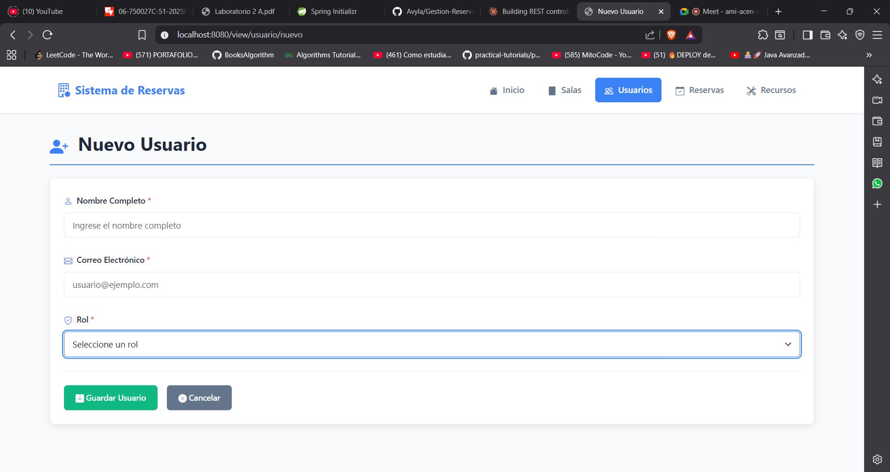
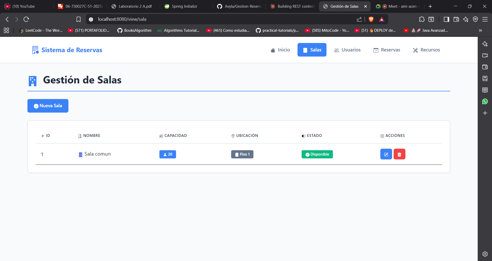
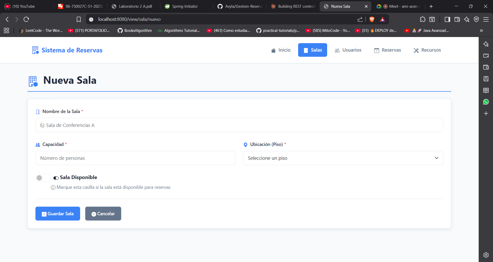
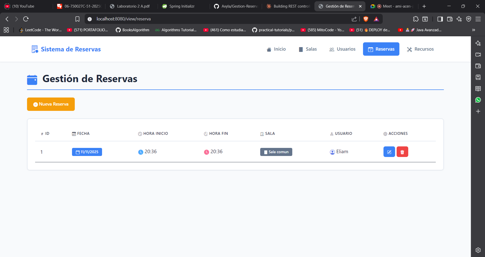
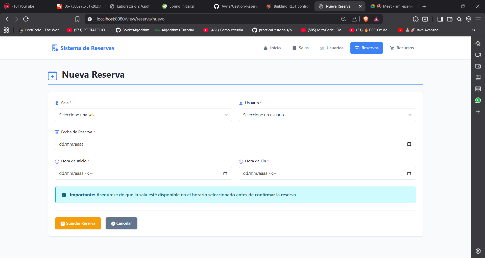
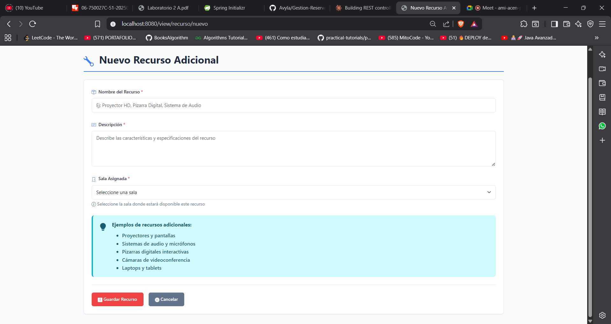

# 🏢 Sistema de Gestión de Reservas de Salas

Sistema web para la gestión de reservas de salas de reuniones desarrollado con Spring Boot y Thymeleaf.

## 📋 Tabla de Contenidos

- [Descripción](#descripción)
- [Características](#características)
- [Tecnologías](#tecnologías)
- [Requisitos Previos](#requisitos-previos)
- [Instalación](#instalación)
- [Configuración](#configuración)
- [Uso](#uso)
- [Estructura del Proyecto](#estructura-del-proyecto)
- [API REST](#api-rest)
- [Capturas de Pantalla](#capturas-de-pantalla)
- [Autores](#autores)

## 📝 Descripción

Sistema web desarrollado como parte del Laboratorio #2 de la materia Desarrollo de Software III. Permite gestionar salas de reuniones, usuarios, reservas y recursos adicionales mediante una interfaz web intuitiva y una API REST completa.

### Objetivo

Construir una aplicación web funcional que permita realizar operaciones CRUD sobre entidades relacionadas mediante llaves foráneas, aplicando arquitectura en capas y buenas prácticas de desarrollo.

## ✨ Características

### Funcionalidades Principales

- **Gestión de Salas**: Crear, listar, editar y eliminar salas con información de capacidad, ubicación y disponibilidad
- **Gestión de Usuarios**: Administrar usuarios con diferentes roles (Administrador, Docente, Estudiante)
- **Gestión de Reservas**: Registrar reservas seleccionando sala y usuario, con control de fechas y horarios
- **Gestión de Recursos**: Asignar recursos adicionales (proyectores, equipos, etc.) a las salas

### Características Técnicas

- ✅ API REST completa con endpoints CRUD
- ✅ Interfaz web responsiva con Bootstrap 5
- ✅ Validaciones en cliente y servidor
- ✅ Relaciones JPA entre entidades
- ✅ Mensajes de confirmación y error
- ✅ Menú de navegación persistente
- ✅ Arquitectura en capas (Controller, Service, Repository)

## 🛠️ Tecnologías

- **Backend**:
    - Java 22
    - Spring Boot 3.5.7
    - Spring Data JPA
    - Spring Validation
    - Lombok

- **Frontend**:
    - Thymeleaf 3.1.3
    - Bootstrap 5.3.0
    - Bootstrap Icons

- **Base de Datos**:
    - PostgreSQL 16.2

- **Herramientas**:
    - Maven
    - Spring DevTools

## 📦 Requisitos Previos

Antes de comenzar, asegúrate de tener instalado:

- Java JDK 22 o superior
- Maven 3.6+
- PostgreSQL 16+ (o la base de datos de tu preferencia)
- Un IDE (IntelliJ IDEA, Eclipse, VS Code)
- Git

## 🚀 Instalación

### 1. Clonar el repositorio
```bash
git clone [https://github.com/Avyla/Gestion-Reservas.git]
```

### 2. Configurar la base de datos

Crear una base de datos en PostgreSQL:
```sql
CREATE DATABASE gestion_reservas;
```

### 3. Configurar application.properties

Edita el archivo `src/main/resources/application.properties`:
```properties
# Configuración de la base de datos
spring.datasource.url=jdbc:postgresql://localhost:5432/gestion_reservas
spring.datasource.username=TU_USUARIO
spring.datasource.password=TU_CONTRASEÑA

# Configuración de JPA/Hibernate
spring.jpa.hibernate.ddl-auto=update
spring.jpa.show-sql=true
spring.jpa.properties.hibernate.format_sql=true

# Puerto del servidor (opcional)
server.port=8080
```

### 4. Compilar y ejecutar
```bash
# Compilar el proyecto
mvn clean install

# Ejecutar la aplicación
mvn spring-boot:run
```

O desde tu IDE, ejecuta la clase principal `GestionReservasApplication.java`

### 5. Acceder a la aplicación

Abre tu navegador y visita:
```
http://localhost:8080
```

## ⚙️ Configuración

### Configuración de Base de Datos

El proyecto está configurado para usar PostgreSQL por defecto. Para cambiar a otra base de datos:

#### MySQL
```properties
spring.datasource.url=jdbc:mysql://localhost:3306/gestion_reservas
spring.datasource.driver-class-name=com.mysql.cj.jdbc.Driver
```

## 📖 Uso

### Interfaz Web

#### 1. Página de Inicio

Al acceder a `http://localhost:8080`, verás el menú principal con acceso a:

- 🏢 Gestión de Salas
- 👥 Gestión de Usuarios
- 📅 Gestión de Reservas
- 🛠️ Gestión de Recursos

#### 2. Gestión de Usuarios

**Crear un usuario:**
1. Ir a "Gestión de Usuarios"
2. Click en "Nuevo Usuario"
3. Completar: Nombre, Correo, Rol
4. Guardar

**Roles disponibles:**
- ADMIN: Administrador del sistema
- DOCENTE: Profesor o docente
- ESTUDIANTE: Estudiante

#### 3. Gestión de Salas

**Crear una sala:**
1. Ir a "Gestión de Salas"
2. Click en "Nueva Sala"
3. Completar: Nombre, Capacidad, Ubicación (piso), Estado
4. Guardar

#### 4. Gestión de Reservas

**Crear una reserva:**
1. Ir a "Gestión de Reservas"
2. Click en "Nueva Reserva"
3. Seleccionar Sala y Usuario de las listas desplegables
4. Ingresar Fecha, Hora de Inicio y Hora de Fin
5. Guardar

#### 5. Gestión de Recursos

**Agregar un recurso a una sala:**
1. Ir a "Gestión de Recursos"
2. Click en "Nuevo Recurso"
3. Ingresar Nombre y Descripción del recurso
4. Seleccionar la Sala asignada
5. Guardar

### API REST

La aplicación expone endpoints REST para todas las entidades:

#### Usuarios
```bash
# Listar todos los usuarios
GET http://localhost:8080/api/usuario

# Obtener un usuario por ID
GET http://localhost:8080/api/usuario/{id}

# Crear un usuario
POST http://localhost:8080/api/usuario
Content-Type: application/json

{
  "nombre": "Juan Pérez",
  "correo": "juan@example.com",
  "rol": "DOCENTE"
}

# Actualizar un usuario
PUT http://localhost:8080/api/usuario/{id}
Content-Type: application/json

{
  "usuarioId": 1,
  "nombre": "Juan Pérez Actualizado",
  "correo": "juan.nuevo@example.com",
  "rol": "ADMIN"
}

# Eliminar un usuario
DELETE http://localhost:8080/api/usuario/{id}
```

#### Salas
```bash
# Listar todas las salas
GET http://localhost:8080/api/sala

# Crear una sala
POST http://localhost:8080/api/sala
Content-Type: application/json

{
  "nombre": "Sala de Conferencias A",
  "capacidad": 30,
  "ubicacion": 2,
  "estado": true
}
```

#### Reservas
```bash
# Listar todas las reservas
GET http://localhost:8080/api/reserva

# Crear una reserva
POST http://localhost:8080/api/reserva
Content-Type: application/json

{
  "fecha": "2024-12-15",
  "horaInicio": "2024-12-15T08:00:00",
  "horaFin": "2024-12-15T10:00:00",
  "salaId": 1,
  "usuarioId": 1
}
```

#### Recursos Adicionales
```bash
# Listar todos los recursos
GET http://localhost:8080/api/recurso-adicional

# Crear un recurso
POST http://localhost:8080/api/recurso-adicional
Content-Type: application/json

{
  "nombre": "Proyector HD",
  "descripcion": "Proyector 1080p con HDMI",
  "salaId": 1
}
```

## 📁 Estructura del Proyecto
```
laboratorio2/
├── src/
│   ├── main/
│   │   ├── java/com/univalle/laboratorioII/
│   │   │   ├── controller/
│   │   │   │   ├── RecursoAdicionalController.java
│   │   │   │   ├── ReservaController.java
│   │   │   │   ├── SalaController.java
│   │   │   │   ├── UsuarioController.java
│   │   │   │   └── view/
│   │   │   │       ├── HomeViewController.java
│   │   │   │       ├── RecursoAdicionalViewController.java
│   │   │   │       ├── ReservaViewController.java
│   │   │   │       ├── SalaViewController.java
│   │   │   │       └── UsuarioViewController.java
│   │   │   ├── entity/
│   │   │   │   ├── RecursoAdicionalEntity.java
│   │   │   │   ├── ReservaEntity.java
│   │   │   │   ├── SalaEntity.java
│   │   │   │   ├── UsuarioEntity.java
│   │   │   │   ├── dto/
│   │   │   │   │   ├── RecursoAdicionalDTO.java
│   │   │   │   │   ├── ReservaDTO.java
│   │   │   │   │   ├── SalaDTO.java
│   │   │   │   │   └── UsuarioDTO.java
│   │   │   │   └── enums/
│   │   │   │       └── RolEnum.java
│   │   │   ├── repository/
│   │   │   │   ├── RecursoAdicionalRepository.java
│   │   │   │   ├── ReservaRepository.java
│   │   │   │   ├── SalaRepository.java
│   │   │   │   └── UsuarioRepository.java
│   │   │   ├── service/
│   │   │   │   ├── RecursoAdicionalService.java
│   │   │   │   ├── ReservaService.java
│   │   │   │   ├── SalaService.java
│   │   │   │   └── UsuarioService.java
│   │   │   └── GestionReservasApplication.java
│   │   └── resources/
│   │       ├── templates/
│   │       │   ├── index.html
│   │       │   ├── sala/
│   │       │   │   ├── lista.html
│   │       │   │   └── formulario.html
│   │       │   ├── usuario/
│   │       │   │   ├── lista.html
│   │       │   │   └── formulario.html
│   │       │   ├── reserva/
│   │       │   │   ├── lista.html
│   │       │   │   └── formulario.html
│   │       │   └── recurso/
│   │       │       ├── lista.html
│   │       │       └── formulario.html
│   │       └── application.properties
│   └── test/
├── pom.xml
└── README.md
```

## 📸 Capturas de Pantalla

### Página de Inicio

*Página principal con acceso rápido a todos los módulos*

### Gestión de Usuarios

*Listado de usuarios con opciones de editar y eliminar*


*Formulario para crear/editar usuarios con validaciones*

### Gestión de Salas

*Listado de salas con información de capacidad y estado*


*Formulario para crear/editar salas*

### Gestión de Reservas

*Listado de reservas con información de sala y usuario*



*Formulario para crear reservas con listas desplegables*


### Gestión de Recursos

*Listado de recursos adicionales asignados a salas*


*Formulario para agregar recursos a las salas*

## 👥 Autores

- **[Eliam Avila]** - [2266372]

## 📄 Información del Laboratorio

- **Laboratorio**: #2 - Modelo A
- **Programa**: Tecnología en Sistemas
- **Materia**: Desarrollo de Software III
- **Docente**: Mg(c). Juan Pablo Pinillos Reina
- **Universidad**: Universidad del Valle - Sede Tuluá
- **Fecha**: [11/11/2025]

## 📝 Licencia

Este proyecto fue desarrollado con fines académicos para el Laboratorio #2 de la materia Desarrollo de Software III.

---